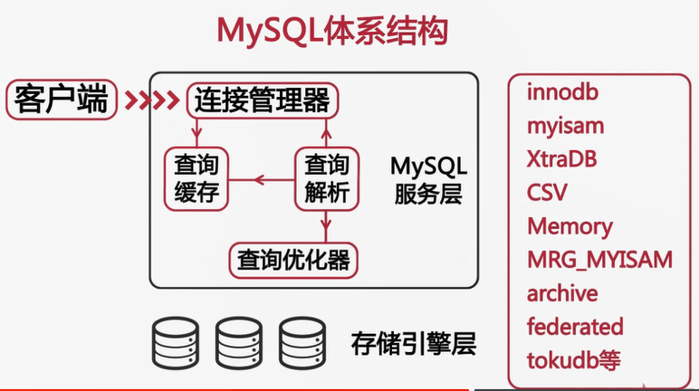

### 影响性能的几个方面
* 服务器硬件
* 操作系统
* 数据存储引擎
    * MyISAM：不支持事务，表级锁
    * InnoDB：支持事务，完美支持行级锁
* 数据库参数配置（上百个）
* 库表结构设计和SQL语句（最主要）

### 如何选择CPU
* 若应用是CPU密集型（压力大），选更好而不是更多
* 单个SQL只能由单个CPU处理，CPU越多越好
* 64位（默认配置）
* 内存越多越好，超过硬盘部分，提升其他服务性能
* 选主板支持的最高主频，频率高，速度快
* 组成购买升级，买同样的，最好单条

### 操作系统
选64位，32位单独进程只能用上4G内存

### MySQL版本
老版本对多核CPU支持不好，推荐使用最新版（5.7+）

### 磁盘配置和选择
* 传统磁盘：价格低、容量大、读写速度慢；转速越高，读写越快；尺寸越小，读写越快

* RAID增加传统机械硬盘性能

    把多个容量小的磁盘组成一组容量更大的磁盘，并提供数据冗余来保证数据完整性的技术  

    分类：
    * RAID 0：多个串联
    * RAID 1：同步镜像（多一倍）
    * RAID 5：分布式奇偶校验快，把数据分散多个磁盘，一个损坏，可以从奇偶校验块重建；两个损坏，则数据不可恢复（多备一块，写较慢，尤其重建，从库采用）
    * RAID 10：先 RAID 1，再 RAID 0，读写良好，重建较 RAID 5更快更简单
    
    选择：
    
        > | 等级 | 特点 | 冗余 | 盘数 | 读 | 写 | 
        > | :-: | :-: | :-: | :-: | :-: | :-: |
        > | RAID 0 | 便宜，快速，危险 | 否 | N | 快 | 快 | 
        > | RAID 1 | 高速度，简单，安全 | 有 | 2 | 快 | 慢 |
        > | RAID 5 | 安全，成本折中 | 有 | N+1 | 快 | 取决最慢盘 |
        > | RAID 10 | 贵，高速，安全 | 有 | 2N | 快 | 快 |

* 固态存储

    适用：大量随机I/O的场景，解决单线程负载的I/O瓶瓶颈
    * 固态硬盘（SSD）
        
        随机读写性能更好，并发性能更好，更易损坏
    
        使用SATA接口，直接替换传统磁盘；若有 SATA接口，同样支持RAID
        
    * PCIe卡（PCI-E SSD/Fusion-IO）（闪存）
    
        无法使用SATA接口，需要独特的驱动和配置
        
        需占用部分服务器内存资源
    
        
### 网络存储SAN和NAS

两种外部文件存储设备加载到服务器上的方法

* SAN：storage area network（存储区域网络）

    SAN -光纤-> 服务器 -硬盘-> SAN
    
    SAN设备通过光纤连接到服务器，设备通过块接口访问，服务器可将其当作硬盘使用
    
    承受大量顺序读写，可以缓存，I/O合并；随机读写慢，甚至不如RAID访问本地磁盘

* NAS：network-attached storage（网络附加存储）

    NAS设备使用网络连接，通过基于文件的协议（NFS/SMB）来访问
    
网络存储适用场景：数据库备份

磁盘性能限制：延迟、吞吐量

网络性格限制：延迟、带宽（吞吐量）

网络对性能的影响：带宽、网络质量

建议：
* 采用高性能和高带宽的网络接口设备和交换机
* 对多个网卡进行绑定，增强可用性和带宽
* 尽可能进行网络隔离（特别是内网和外网的隔离）

### 小结
* CPU
    * 64位CPU一定要工作在64位系统
    * 并发高CPU数量比频率重要
    * CPU密集性场景和复杂SQL则频率越高越好
* 内存
    * 选择主板能用的最高频内存
    * 尽可能大

* I/O子系统
    * PCIe > SSD > RAID 10 > 磁盘 > SAN 

### MySQL适合的操作系统
* Windows 大小写不敏感
* FreeBSD 老版本支持不太好，选最新版本
* Solaris
* Linux 选性能舍桌面，Ubuntu重桌面，可选CentOS

### CentOS系统参数优化

* 内核相关参数（/etc/sysctl.conf）

    ```
    # 每个端口最大监听队列长度
    net.core.somaxconn=65535 
    # 每个网络接收的等待内核处理的数据包队列长度
    net.core.netdev_max_backlog=65535
    # 待连接请求队列长度
    net.ipv4.tcp_max_syn_backlog=65535
      
    # 加快TCP连接回收
    net.ipv4.tcp_fin_timeout=10
    net.ipv4.tcp_tw_reuse=1
    net.ipv4.tcp_tw_recycle=1
      
    # TCP接收发送缓冲区大小默认值和最大值
    net.core.rmem_default=87380
    net.core.rmem_max=16777216
    net.core.wmem_default=87380
    net.core.wmem_max=16777216
      
    # 失效连接占用资源，加快回收效率
    net.ipv4.tcp_keepalive_time=120
    net.ipv4.tcp_keepalive_intvl=30
    net.ipv4.tcp_keepalive_probes=3
    
    # 定义单个共享内存段的最大值，该值必须大到能容纳整个Innodb缓冲池
    # 建议物理内存一半，最大物理内存-1b
    kernel.shmmax=4294967295    
    
    # 内存交换区大小，内存不足时对性能产生比较明显的影响 
    # 建议MySQL服务器上保留交换分区，但控制何时使用
    # 设置0，告诉内核除非虚拟内存完全满了，否则不使用交换分区
    wm.swappiness=0
    ```

* 增加资源限制（/etc/security/limit.conf）

    ```
    # 打开文件数，追加配置文件尾部，重启系统生效
    # * 所有用户有效
    # soft 当前系统生效
    # hard 系统中所能设定的最大值
    # nproc 表示所限制资源为打开内存文件数
    # nofile 表示所限制资源为打开硬盘文件数
    * soft nproc 65535
    * hard nproc 65535
    * soft nofile 65535
    * hard nofile 65535
    ```

* 磁盘调度策略（/sys/block/devname/queue/scheduler）

    * cfq（完全公平调度策略，默认） 
    
    * noop（电梯式调度策略）
    
        实现了一个FIFO队列，有新请求到来，将请求合并到最近请求之后，以此来保证请求同一介质
        
        倾向饿死读而利于写
        
        对闪存设备、RAM及嵌入式系统是最好的选择
        
    * deadline（截止时间调度策略）
    
        确保了在一个截止时间（可调）内服务请求
        
        默认读期限<写期限，防止了写操作因不能被读而饿死的现象
        
        对数据库类应用是最好的选择
    
    * anticipatory（预料I/O调度策略）
    
        本质与deadline一样，但最后一次读操作后，要等待6ms，才能继续对其他I/O进行调度
        
        在每个6ms插入新的I/O流，将小写入流合并成一个大写入流，用写入延时换取最大的写入吞吐量
        
        适合于写入较多的环境，如文件服务器，对数据库环境表现很差

    改变磁盘调度策略：`echo 策略名 > /sys/block/devname/queue/scheduler`
    
### 文件系统对性能的影响
* Windows
    * FAT
    * NTFS（作为服务器可用）
* Linux
    * EXT3
    * EXT4
    * XFS（性能最好）

EXT3/EXT4系统挂载参数（/etc/fstab）

```
# 数据类型：writeback（只元数据写入日志，InnoDB最好选择）、ordered（只记录元数据，但提供了一致性保证，比writeback稍慢，更安全）、journal
data=writeback

# 禁止记录文件访问时间和文件目录读取时间
noatime,nodiratime
```
    
/dev/sda1/ext4

```
noatime,nodiratime,data=writeback 1 1
```

### MySQL体系结构
插件式存储引擎



#### 常用储存引擎：
存储引擎共有的表结构文件：frm
* MyISAM

    表由MYD和MYI组成
    
    特性：
    * 并发性与锁级别
    
        表级锁，修改表需要对整表加锁，读表也要对整表加共享锁（读表时可在表尾插入数据），读写互斥
        
        只读并发性还行，读写混合并发差
    * 表损坏修复
    
        修复表可能会造成数据丢失
        
        ```
        # 检查表
        mysql> check table 表名;
        
        # 恢复表
        mysql> repair table 表名;
        
        # 暂停MySQL，使用myisamchk工具修复
        ```
    * 支持的索引类型
    
        支持全文索引，5.7前唯一原生支持全文索引的官方存储引擎
        
        支持text/blob等类型建立前500的前缀索引
    
    * 支持数据压缩（表压缩后只读）
    
        使用myisampack工具，例：
        ```
        # 压缩指定表文件，并生成 表名.OLD 备份
        > myisampack -b -f 表名.MYI
        ```
    限制：
    * 版本<5.0时默认表大小为4G，如存储大表要修改MAX_Rows和AVG_ROW_LENGTH参数，可能会重建表耗时
    * 版本>5.0默认支持为256T
    
    适用场景：
    * 非事务型应用
    * 只读类应用
    * 空间类应用（5.7前唯一支持空间函数的存储引擎）
    
* Innodb

    MySQL5.5后默认Innodb
    
    Innodb使用表空间进行数据存储
    
    参数：innodb_file_per_table
        * ON：独立表空间 表名.ibd
        * OFF：系统表空间 ibdata序号

    查看表空间存储参数：`mysql> show variables like 'innodb_file_per_table';`
    
    设置表空间存储存储参数（关闭为例）：`mysql> set global innodb_file_per_table=off;`
    
    系统表空间和独立表空间比较：
    * 收缩：
    
        系统表空间无法简单的收缩文件大小，独立表空间可通过`mysql> optimize table 表名`命令收缩系统文件
    
    * IO性能：
    
        系统表空间会产生IO瓶颈，独立表空间可以同时向多个文件刷新数据
    
    建议：对Innodb使用独立表空间
    
    系统表空间->独立表空间：
    1. 使用mysqldump导出所有数据库表数据
    2. 停止MySQL服务器，修改参数，并删除Innodb相关文件
    3. 重启MySQL服务，重建Innodb系统表空间
    4. 重新导入数据
    
    系统表空间存储的数据：
    * Innodb数据字典信息
    * Undo回滚段（5.7可以移出）
    
    特性：
    * Innodb是一种事务性存储引擎，完全支持事务的ACID特性，Redo Log 和 Undo Log
    * 支持行级锁，最大程度支持并发，由存储引擎层实现
    * Innodb状态检查
        * 上次检查到现在平均值统计信息，检查间隔至少30s
        * `mysql> show engine innodb status`
    
    Redo Log:
    * 保证持久性，通常每秒刷新到磁盘，日志文件名称：ib_logfile序号
    * 参数innodb_log_buffer_size决定缓冲区大小
    * 参数innodb_log_files_in_group决定日志文件数量
    
    适应场景（5.7支持全文索引、空间函数）：
    * 适合大多数OLTP（联机事务处理过程）应用

* CSV

    数据以文本方式存储在文件中
    * .CSV文件存储表内容
    * .CSM文件存储表的元数据如表状态和数据量
    
    特点：
    * 以CSV格式进行数据存储，例：
    
        > 1,"aaa","bbb"  
        > 2,"ccc","ddd"

    * 所有列不能为NULL（建表时声明not null）
    * 不支持索引（不适合大表，不适合在线处理）
    * 可以对数据文件直接编辑
    
    适用场景：
    * 适合做为数据交换的中间表

* Archive

    特点：
    * 以zlib对表数据进行压缩，磁盘I/O更少
    * 数据存储在ARZ后缀文件中
    * 只支持instert和select操作
    * 只运行在自增ID列上加索引

    使用场景：
    * 日志和数据采集类应用

* Memory

    也称HEAP（堆内存）存储引擎，数据保存在内存中
    
    功能特点：
    * 支持HASH索引（等值查找）和BTree索引（范围查找）
        * 建立hash索引：`mysql> create index 索引名 on 表名(字段名);`
        * 建立btree索引：`mysql> create index 索引名 using btree on 表名(字段名);`
    * 所有字段都为固定长度
    * 不支持BLOG和TEXT等大字段
    * 使用表级锁
    * 容量上限由参数max_heap_table_size（默认16M）决定，修改对已有表无效
    
    Memory表和临时表区别：
    * 临时表（当前session可见）：
    
        系统使用临时表
        * 超过限制使用Myisam临时表
        * 未超过限制使用Memory表
        
        create temporary table 建立的临时表
    * Memory（所有系统可以使用）
    
    应用场景：
    * 用于查找或者时映射表，如右边和地区的对应表
    * 用于保存数据分析中产生的中间表
    * 用户缓存周期性聚合数据的结果表
    
    注意：数据易丢失，所以要求数据可再生

* Federated
    
    特点：
    * 提供了访问远程MySQL服务器上表的方法
    * 本地不存储数据，数据全放到远程服务器上
    * 本地需要保存表结构和远程服务器的连接信息
    
    使用：

    * 默认禁止，启动在my.cnf文件追加：federated=1
    * 远程创建表，添加访问权限用户；本地创建表（创建语句 connection='mysql://用户名[:密码]@主机名[:端口号]/数据库名/表名;'）
    
    使用场景：
    * 偶尔的统计分析及手工查询

### 选择存储引擎
* 事务：主Innodb；无事务，主insert/select，可选Myisam；主insert，select少，可选Archive
* 备份：仅Innodb有在线热备方案
* 崩溃恢复：Innodb优于Myisam
* 存储引擎的特有特点
* 尽量避免混合使用存储引擎，事务、热备易出问题

### 锁
作用：
* 主要作用：管理共享资源的并发访问
* 用于实现事务的隔离性

分类：
* 共享锁（读锁）
* 独占锁（写锁）

粒度：
* 表级锁
    * 加锁：`mysql> lock table 表名 read或write;`
    * 解锁：`mysql> unlock tables;`
    * 解锁：连接关闭
* 行级锁

阻塞和死锁：
* 阻塞：锁等待其它锁释放资源
* 死锁：两个或以上的事务相互占用对方等待的资源，少量系统自动处理

### MySQL服务器参数

获取配置信息路径：

* 命令行参数

    `> mysqld_safe --datadir=/data/sql_data`
* 配置文件

    `> mysqld --help --verbose | grep -A 1 'Default options'`

    > /etc/my.cnf  
    > /etc/mysql/my.cnf  
    > /home/mysql/my.cnf  
    > ~/my.cnf  
    
配置参数作用域：

* 全局（有些对已有会话不生效）

    `mysql> set global 参数名=参数值;`  
    `mysql> set @@global.参数名 :=参数值;`
* 会话

    `mysql> set [session] 参数名=参数值;`  
    `mysql> set @@session.参数名 :=参数值;`

内存相关配置参数：

* 确定可使用内存上限

* 确定单个连接使用的内存
    * sort_buffer_size 给排序分配内存
    * join_buffer_size 给每个关联表分配的内存
    * read_buffer_size Myisam全表扫描分配的读缓冲（4k倍数）
    * read_rnd_buffer_size  查询需要时分配索引缓冲

* 确定需要为操作系统保留多少内存
    * 推荐专用数据库服务器 

* 如何为缓冲池分配内存
    * Innodb_buffer_pool_size Innodb缓存索引和数据， 若纯Innodb引擎，总内存-单线程需内存*连接数-系统保留内存
    * key_buffer_size Myisam索引缓冲，Myisam的数据缓存占用系统缓存；因为mysql系统使用Myisam，所以该内存一定要分配
        ```
        # 查询Myisam表索引占用空间
        mysql> select sum(index_length) from information_schema.tables where engine='myisam';
        ```

I/O相关配置参数：

* Innodb
    * Innodb_log_file_size 单个事务日志大小
    * Innodb_log_files_in_group 控制事务日志文件个数
    * 事务日志总大小=Innodb_log_file_size*Innodb_log_files_in_group
    * Innodb_log_buffer_size 日志缓冲区大小
    * Innodb_flush_log_at_trx_commit
        * 0：每秒log写入cache，并刷新log到磁盘
        * 1：默认，每次事务提交，执行log写入cache并刷新log到磁盘
        * 2：推荐，每次事务提交，执行log写入cache；每秒刷新log到磁盘
    * Innodb_flush_method=O_DIRECT 刷新方式，推荐
    * Innodb_file_per_table=1 设置独立表空间，推荐
    * Innodb_doublewrite=1 设置双写缓冲，推荐

* Myisam
    * delay_key_write 
        * OFF：每次写操作后刷新新建缓冲中的脏块到磁盘
        * ON：只对在建表时制定了delay_key_write选项的表使用延迟刷新
        * ALL：对所有Myisam表都使用延迟键写入

安全相关配置参数：

* expire_logs_days 指定自动清理binlog的天数，每天全备，可设置7+

* max_allowed_packet 控制mysql可接收包的大小，如32m；主从库保持一致

* skip_name_reslove 禁用DNS查找，推荐，但是要授权数据库对指定ip可访问

* sysdate_is_now 确保sysdate()返回确定性日期，建议

* read_only 禁止非super权限的用户写权限，建议从库使用

* skip_slave_start 禁用slave自动恢复，推荐

* sql_mode 设置mysql使用的sql模式
    * strict_trans_tables 数据不能插入事务写存储引擎，则终中断
    * no_engine_subtitution 建表语句不默认存储引擎（默认情况下，错误引擎被忽略，采用默认引擎）
    * no_zero_date 日期字段不能写入0000-00-00这类日期
    * no_zero_in_date 不接受部分日期为0的日期
    * only_full_group_by 要求分组查询中，group by语句把所有没有聚合函数（count()等）的列列出来，否则不能执行

其他常用配置

* sync_binlog 控制mysql向磁盘刷新binlog的方式
    * 0：默认，mysql不主动，由操作系统决定
    * 大于0数值：两次刷新间隔，binlog日志写操作次数，推荐1

* tmp_table_size 和 max_heap_table_size 控制内存临时表大小

* max_connections 控制允许的最大连接数，要改大

### 数据库设计对性能的影响
* 过分的反范式化，表太多的列
* 过分的范式化，造成太多的表关联（建议不超过10个）
* 在OLTP（联机事务处理过程）环境使用不恰当的分区表
* 使用外键约束保证数据的完整性，效率非常低，备份维护麻烦

### 总结
* 数据库结构设计和SQL语句
* 存储引擎选择和参数配置
* 系统选择及优化
* 硬件升级
